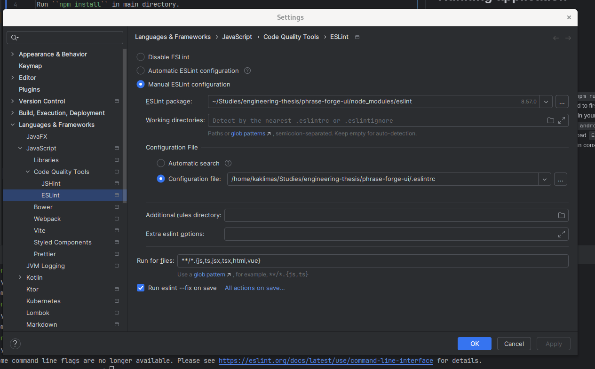

# Running application

## Build
Run ``npm install`` in main directory.

## Run
 - To run application in web mode simply run ``npm run web``.

 - To run application in android mode you will need to first set 
system variable `ANDROID_HOME` to path of android installation in 
your system - installation of Android SDK is needed. Then run ``npm run android``.

 - To run application on your mobile phone download `Expo Go` application. Then run ``npm start``
and scan generated in console QR Code.

## Run mock server
Go to ``mock-server`` directory and run ``npm install`` and then ``npm start``

## Configure eslint

Configuration should look similar to the one presented below
